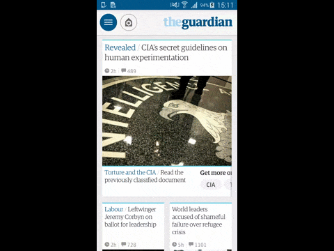

RadialActionMenu
=======



# What is this?
An implementation of a radial action menu. The implementation is designed specifically for our use-case but should be fairly simple to customise.
This implementation has been tested with up to 4 action items.

# How to use this?
Define the layout in the root view of your Fragment/Activity and provide some attributes.
```xml
<com.theguardian.ui.RadialActionMenuView
    android:id="@+id/long_press_view"
    android:layout_width="match_parent"
    android:layout_height="match_parent"
    app:positioningRadius="100dp"
    app:actionButtonSelectedRadius="45dp"
    app:circleRadius="35dp"
    app:unselectedStrokeWidth="1dp"
    app:selectedActionButtonRadius="30dp"
    app:actionButtonRadius="25dp"
    app:iconTextSize="22dp"
    app:primaryColor="@color/action_bar_home_icon_default"
    app:secondaryColor="@color/white"
    app:circleBackgroundInactive="@color/card_fade"
    app:descriptionTextSize="@dimen/card_meta_text_size"
    app:circleColor="@color/long_press_circle_color"
    app:circleStrokeWidth="6dp"
    />
```

Then in your Fragment/Activity set a typeface you'd like to use for the description text.

```java
radialActionMenu = (RadialActionMenuView) findViewById(R.id.radial_action_menu);
radialActionMenu.setDescriptionTypeface(TypefaceHelper.getAgateRegular());
```

And when a user long-presses on a view, activate the long press radial action menu, passing your long press action with some description text, an ID, and a callback.

```java
List<RadialActionMenuAction> actions = new ArrayList<>();
actions.add(new IconFontRadialActionMenuAction(new RadialActionMenuIcon(R.integer.save_page_icon, tf), getString(R.string.long_press_save), 0));
actions.add(new IconFontRadialActionMenuAction(new RadialActionMenuIcon(R.integer.share_icon, tf), getString(R.string.long_press_share), 1));
radialActionMenu.showMenu(selected -> {
    switch (selected.id) {
        case 0:
            handleSave();
            break;
        case 1:
            handleShare();
            break;
    }
}, actions);
```

# Custom behaviour
For changing values in the existing implementation use the provided view attributes. Should you want to customise further you can override the rendering of action items or the default positioning.

## Positioning of the action items
 Create a custom class which implements ```PositionCalculator```, and set it on the RadialActionMenuView using ```setPositionCalculator(...)```.

 For each ActionButtonDataHolder passed in the active areas array be sure to call ```setPosition(x, y)``` given your calculated position of that active area.

 See [DefaultPositionCalculator](https://github.com/guardian/RadialActionMenu/blob/master/library/src/main/java/com/theguardian/ui/DefaultPositionCalculator.java) for the default implementation

## Action item and label rendering
 Create a custom class which implements ```ActionButtonRenderer```, and set it on the RadialActionMenuView using ```setActionButtonRenderer(...)```.

 Perform any drawing logic in ```draw(...)```. See [DefaultActionButtonRenderer](https://github.com/guardian/RadialActionMenu/blob/master/library/src/main/java/com/theguardian/ui/DefaultActionButtonRenderer.java) for the default implementation

# License
RadialActionMenu is released under the Apache 2.0 license.

This implementation was partially inspired by [CircularFloatingActionMenu](https://github.com/oguzbilgener/CircularFloatingActionMenu)